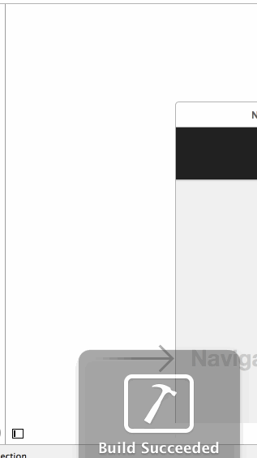

# RottenTomatoes Box Office Demo

This is a demo application for displaying the latest box office movies using the [RottenTomatoes API](http://www.rottentomatoes.com/).

Time spent: 7 hours spent in total

Completed user stories:
 * [x] User can view a list of movies from Rotten Tomatoes. Poster images must be loading asynchronously.
 * [x] User can view movie details by tapping on a cell
 * [ ] User sees loading state while waiting for movies API. You can use one of the 3rd party libraries at cocoacontrols.com.
 * [x] User sees error message when there's a networking error. You may not use UIAlertView to display the error. See this screenshot for what the error message should look like: network error screenshot.
 * [x] User can pull to refresh the movie list.
 * [ ] All images fade in (optional)
 * [ ] For the large poster, load the low-res image first, switch to high-res when complete (optional)
 * [ ] All images should be cached in memory and disk. In other words, images load immediately upon cold start (optional).
 * [ ] Customize the highlight and selection effect of the cell. (optional)
 * [x] Customize the navigation bar. (optional)
 * [ ] Add a tab bar for Box Office and DVD. (optional)
 * [ ] Add a search bar. (optional)

Walkthrough of all user stories:

GIF created with [LiceCap](http://www.cockos.com/licecap/).
